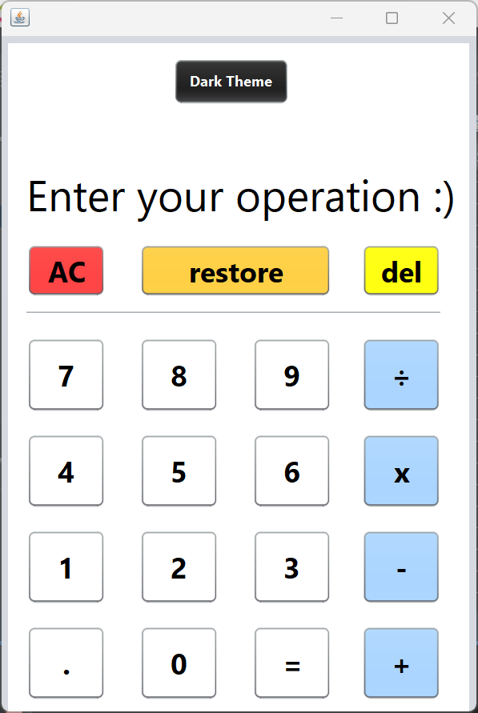

# Minimal Java Calculator

Minimal Java Calculator with Dark mode support


## Screens



## Get the source
```
git clone https://github.com/daviiid99/Minimal_Calculator Minimal_Calculator
cd Minimal_Calculator/dist
java -jar "JavaCalculatorApp.jar" 
```
 